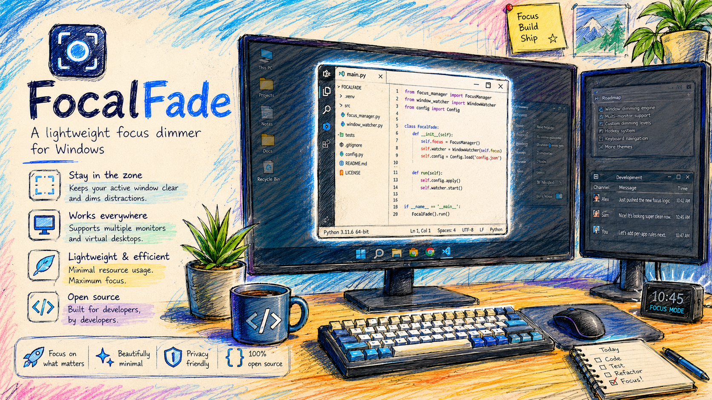

# FocalFade

**Lightweight focus dimmer for Windows**

<p align="center">
  
</p>

<p align="center">
  <a href="README.zh-CN.md">中文</a>
</p>

FocalFade helps you focus by gently fading everything except what you are working on.

## Features

- Automatic focus tracking - keeps your active window clear while dimming the rest
- Robust active-window detection that filters out shell surfaces, desktop icons, USB device icons, and transient windows
- Multiple focus modes: Active Window, Active App, Current Monitor, All Monitors
- Multi-monitor support with per-monitor DPI awareness and correct negative-coordinate handling
- Customizable opacity, dim color with RGB sliders and presets, corner radius, and focus margin
- Per-app opacity rules
- Full hotkey customization UI (click-to-bind)
- Presentation Mode for screen sharing and recording
- Global hotkeys for quick control
- Experimental blur effect behind dimmed areas
- System tray utility - minimal footprint, no main window
- App exclusion rules (e.g., don't dim fullscreen games, OBS, video players)
- Start with Windows option
- Pause on fullscreen apps
- Hide overlay while dragging windows
- Tray icon theme matching (Auto/Light/Dark)
- Experimental blur effect (off by default)
- Local-only: no telemetry, no network calls

## Screenshots

<p align="center">
  
</p>

## Install

### Download Portable
1. Download the latest `FocalFade-win-x64-portable.zip` from [Releases](../../releases)
2. Extract to any folder
3. Run `FocalFade.exe`
4. The tray icon will appear in the system tray

### Build from Source

Requires [.NET 8 SDK](https://dotnet.microsoft.com/download) or later.

```bash
git clone https://github.com/watt-tang/FocalFade.git
cd FocalFade
dotnet build
dotnet run --project src/FocalFade.App
```

To publish a self-contained executable:
```bash
dotnet publish src/FocalFade.App/FocalFade.App.csproj -c Release -r win-x64 --self-contained true -p:PublishSingleFile=true
```

## Usage

### Tray Menu
Right-click the FocalFade tray icon to access:
- **Enabled/Disabled** - Toggle focus dimming
- **Mode** - Choose Active Window, Active App, Current Monitor, or All Monitors
- **Opacity** - Adjust dimming intensity (20% to 70%)
- **Presentation Mode** - Stronger dim with optional border for presentations
- **Settings** - Open the full settings window
- **Exit** - Close FocalFade completely

### Default Hotkeys
| Hotkey | Action |
|--------|--------|
| `Ctrl+Alt+F` | Toggle enabled/disabled |
| `Ctrl+Alt+Up` | Increase opacity |
| `Ctrl+Alt+Down` | Decrease opacity |
| `Ctrl+Alt+P` | Toggle Presentation Mode |
| `Ctrl+Alt+Space` | Peek (hide overlay for 10 seconds) |
| `Ctrl+Alt+S` | Open settings |

### Settings Window
Double-click the tray icon or select "Settings..." from the menu to configure:
- General behavior (start with Windows, pause on fullscreen, hide while dragging)
- Appearance (opacity, colors with presets, margins, corner radius, animations)
- Focus behavior (mode, fullscreen handling)
- App exclusion rules with per-app opacity overrides
- Hotkey reference
- Tray icon theme (Auto/Light/Dark)
- Diagnostics (version, log folder, reset settings)

## Privacy

FocalFade is privacy-focused:
- **No telemetry** - zero data collection
- **No network calls** - completely offline
- **Local settings only** - stored in `%APPDATA%\FocalFade\settings.json`
- **Local logs only** - stored in `%LOCALAPPDATA%\FocalFade\Logs\`
- Window titles are NOT logged by default (opt-in verbose logging)

See [PRIVACY.md](docs/PRIVACY.md) for the full privacy policy.

## Platform Support

- Windows 10 22H2 or later
- Windows 11
- Multi-monitor setups
- Mixed DPI displays

## Limitations

- **UAC Secure Desktop**: Windows prevents apps from overlaying the secure desktop (UAC prompts, lock screen). FocalFade naturally pauses in these scenarios.
- **Fullscreen Games/Apps**: Some games and fullscreen applications may force the overlay behind or ahead unpredictably. FocalFade defaults to pausing overlay for fullscreen apps.
- **Admin/Elevated Windows**: Windows running as administrator may appear above the overlay. FocalFade does not require elevation by default.
- **Blur Effect**: The experimental blur feature may not work on all systems. If unsupported, FocalFade falls back to normal dimming.
- **Mixed DPI**: If you experience offset issues with mixed DPI monitors, please report your monitor layout.

## Troubleshooting

See [TROUBLESHOOTING.md](docs/TROUBLESHOOTING.md) for common issues and solutions.

## Contributing

See [CONTRIBUTING.md](CONTRIBUTING.md) for guidelines.

## License

MIT License - see [LICENSE](LICENSE)

## Roadmap

- [ ] Blur effect support for more Windows versions and configurations
