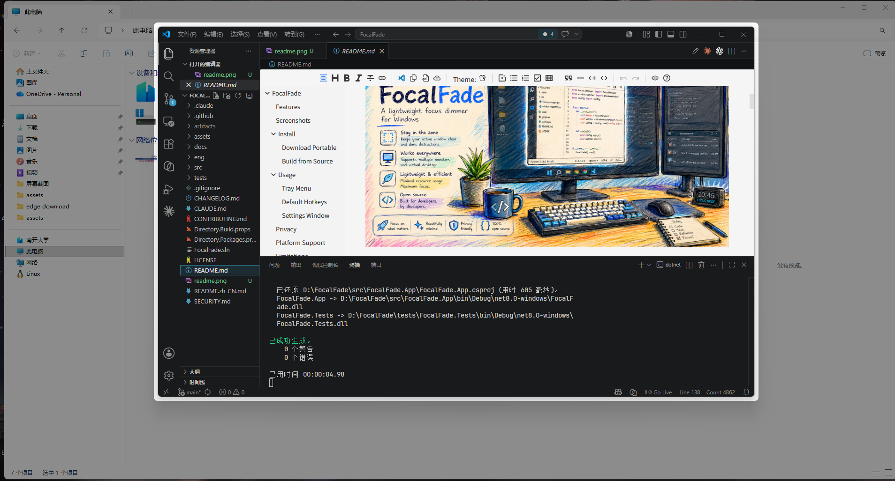

# FocalFade

**Windows 轻量级焦点遮罩工具**

<p align="center">
  
</p>

<p align="center">
  <a href="README.md">English</a>
</p>

FocalFade 帮助你集中注意力——柔和地遮罩当前窗口以外的所有内容，让你专注于正在处理的工作。

## 功能特性

- 自动焦点追踪——保持当前活动窗口清晰，遮罩其余部分
- 精准的活动窗口检测，过滤 Shell 面、桌面图标、USB 设备图标、通知弹窗等干扰元素
- 多种焦点模式：活动窗口、活动应用、当前显示器、全部显示器
- 多显示器支持，正确处理每台显示器的 DPI 和负坐标
- 可自定义遮罩透明度、颜色（含 RGB 滑块和预设）、圆角、焦点边距
- 按应用设置独立透明度规则
- 完整的快捷键自定义界面（点击绑定）
- 演示模式，适合屏幕分享和录屏
- 全局快捷键快速控制
- 实验性模糊效果（遮罩区域背景模糊，焦点窗口保持清晰）
- 系统托盘常驻，无主窗口，占用极小
- 应用排除规则（如全屏游戏、OBS、视频播放器等自动跳过遮罩）
- 开机自启选项
- 全屏应用自动暂停
- 拖拽窗口时自动隐藏遮罩
- 托盘图标主题跟随系统（自动/浅色/深色）
- 纯本地运行：无遥测、无网络请求

## 截图

<p align="center">
  
</p>

## 安装

### 下载便携版
1. 从 [Releases](../../releases) 下载最新的 `FocalFade-win-x64-portable.zip`
2. 解压到任意文件夹
3. 运行 `FocalFade.exe`
4. 系统托盘将出现 FocalFade 图标

### 从源码构建

需要 [.NET 8 SDK](https://dotnet.microsoft.com/download) 或更高版本。

```bash
git clone https://github.com/watt-tang/FocalFade.git
cd FocalFade
dotnet build
dotnet run --project src/FocalFade.App
```

发布独立可执行文件：
```bash
dotnet publish src/FocalFade.App/FocalFade.App.csproj -c Release -r win-x64 --self-contained true -p:PublishSingleFile=true
```

## 使用方法

### 托盘菜单
右键点击系统托盘中的 FocalFade 图标：
- **启用/禁用** — 开关焦点遮罩
- **模式** — 选择活动窗口、活动应用、当前显示器或全部显示器
- **透明度** — 调整遮罩浓度（20% 到 70%）
- **演示模式** — 更强的遮罩 + 可选边框，适合演示
- **设置...** — 打开完整设置窗口
- **退出** — 完全关闭 FocalFade

### 默认快捷键
| 快捷键 | 功能 |
|--------|------|
| `Ctrl+Alt+F` | 启用/禁用 |
| `Ctrl+Alt+Up` | 增加透明度 |
| `Ctrl+Alt+Down` | 降低透明度 |
| `Ctrl+Alt+P` | 切换演示模式 |
| `Ctrl+Alt+Space` | 临时查看（10 秒） |
| `Ctrl+Alt+S` | 打开设置 |

### 设置窗口
双击托盘图标或从菜单选择"设置..."：
- 常规设置（开机自启、全屏暂停、拖拽时隐藏）
- 外观设置（透明度、颜色选择器含 RGB 滑块、边距、圆角、动画）
- 焦点行为（模式、全屏处理）
- 应用排除规则及按应用透明度覆盖
- 快捷键自定义（点击绑定）
- 托盘图标主题（自动/浅色/深色）
- 诊断信息（版本、日志目录、重置设置）

## 隐私

FocalFade 注重隐私保护：
- **无遥测** — 零数据收集
- **无网络请求** — 完全离线运行
- **仅本地设置** — 存储在 `%APPDATA%\FocalFade\settings.json`
- **仅本地日志** — 存储在 `%LOCALAPPDATA%\FocalFade\Logs\`
- 默认不记录窗口标题（可选开启详细日志）

完整隐私政策见 [PRIVACY.md](docs/PRIVACY.md)。

## 平台支持

- Windows 10 22H2 或更高版本
- Windows 11
- 多显示器配置
- 混合 DPI 显示器

## 已知限制

- **UAC 安全桌面**：Windows 系统安全机制，UAC 弹窗和锁屏界面无法被遮罩，FocalFade 会自动暂停。
- **全屏游戏/应用**：部分游戏和全屏应用可能强制覆盖层级，FocalFade 默认在全屏时暂停遮罩。
- **管理员权限窗口**：以管理员身份运行的窗口可能显示在遮罩之上。FocalFade 默认不需要管理员权限。
- **模糊效果**：实验性功能，在部分系统上可能不可用，会自动回退到普通遮罩。
- **混合 DPI**：如遇到多显示器 DPI 不同导致的偏移问题，请反馈你的显示器配置。

## 故障排除

见 [TROUBLESHOOTING.md](docs/TROUBLESHOOTING.md)。

## 贡献

见 [CONTRIBUTING.md](CONTRIBUTING.md)。

## 许可证

MIT 许可证 - 见 [LICENSE](LICENSE)

## 路线图

- [ ] 更多 Windows 版本的模糊效果支持
